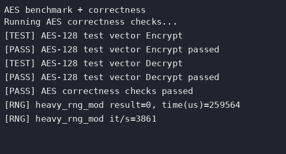

# 26-Arch Lab+ 实验报告

## 1. 基本信息

- 姓名：潘孝圆
- 学号：24300240128
- 课程：计算机组成与体系结构（2026 春）
- 实验：Lab+
- 完成日期：2026-06-20

## 2. 完成内容

本次 Lab+ 在已有 Lab1-Lab6 实现基础上继续补充 bonus。主要完成项如下：

- 保留并验证 Lab1 extra 的乘除法扩展支持。
- 保留 Nexys4 上板适配，继续使用非 Basys3 开发板配置。
- 保存 Nexys4 DDR Vivado 工程元数据：工程 top 使用 `basys3_top` 兼容 wrapper，XDC 使用 Nexys4 DDR 管脚，BRAM/clk_wiz IP 目标器件同步为 `xc7a100tcsg324-1`。
- 保留 Lab5 的 Sv39 MMU、2 MiB/1 GiB hugepage 支持、特权级和 Lab6 异常中断实现。
- 新增 Lab+ atomic extension：实现 AMO W 系列指令以及 `LR.W/SC.W`，并接入 difftest atomic event。
- 新增前端性能优化：顺序取指提前发起请求、`CBusArbiter` idle fast path、`IBusToCBus` 8B 指令行缓冲，以及 32 项 2-bit BHT 动态分支预测，减少连续取指和循环分支空泡。
- 新增 PMP/privfull 支持：支持 `pmpcfg0` 中 8 个 PMP entry 的 `OFF/TOR/NA4/NAPOT` 匹配，产生 instruction/load/store access fault，并通过 `lab+/4` privileged sys-test。
- 新增 `EBREAK` 断点异常支持：SYSTEM/funct12=`0x001` 触发同步异常 cause 3。
- 新增 `FENCE/FENCE.I` 合法 no-op 支持，提升编译器生成程序的兼容性。
- 新增 `WFI` 合法 no-op 支持，覆盖 S 态内核空闲等待指令的仿真兼容。
- 新增 xv6 主线部分进展：补充真实 S-mode、`SRET`、异常/中断委托和 S 态 trap CSR 写入路径。
- 新增 S 态中断 pending 委托转换：当 `mideleg` 委托 SSIP/STIP/SEIP 时，将 `swint/trint/exint` 映射到对应 S pending 位。
- 新增 MMU page fault 与 PTE 权限检查：识别 Sv39 非 canonical 地址、无效 PTE、叶子页权限不满足、巨页 PPN 未对齐，并产生 instruction/load/store page fault。
- 新增 `SUM/MXR` 支持：`MXR` 允许 load 读取 execute-only 页，`SUM` 允许 S 态数据访问 U 页，同时保持 S 态不能从 U 页取指。
- 新增 PTE A/D 位硬件更新：叶子 PTE 的 `A=0` 或写访问 `D=0` 时，MMU 先写回更新后的 PTE，再继续最终访存。
- 新增仿真侧 virtio/disk MMIO：在 `0x10001000` 暴露 virtio-mmio 识别寄存器、`ConfigGeneration` 和 virtio-blk config 字段，提供包含 `SIZE_MAX/SEG_MAX/BLK_SIZE/FLUSH/DISCARD/WRITE_ZEROES` 的 feature negotiation，提供同步 512B sector 读写扩展，支持 `Status=0` reset、2 条 split queue 的独立 descriptor/avail/used ring 状态、indirect descriptor、一次 `QueueNotify` drain 多个 pending avail entry、event idx 中断抑制/触发、`VIRTIO_BLK_T_FLUSH` status-only 请求、`VIRTIO_BLK_T_DISCARD` no-op 成功请求和 `VIRTIO_BLK_T_WRITE_ZEROES` 清零请求，以及 xv6 风格不协商 event idx 时的普通 avail flags 中断控制，并支持 `+simple_blk_image=...` 从二进制镜像初始化 disk。
- 新增仿真侧 CLINT 地址兼容：`SimMemoryWithVirtio` 将 QEMU/xv6 `0x0200...` 的 `msip/mtimecmp/mtime` 地址映射到课程框架 `0x3800...` 地址。
- 新增仿真侧 PLIC MMIO 模型：支持 source priority、pending、M/S enable、M/S threshold、claim/complete，并将 simple virtio block 完成事件接到 PLIC source 1、UART 事件接到 PLIC source 10。
- 新增仿真侧 16550 UART MMIO 模型：在 `0x10000000` 兼容 xv6/QEMU UART 初始化、TX 输出、THRE/FIFO timeout interrupt、16B RX FIFO/RBR 读取、FCR trigger/clear、LSR overrun/parity/framing/break、break-only line-status 和 MSR modem-status loopback，并将 UART interrupt 接到 PLIC source 10。
- 新增 xv6/QEMU platform smoke 集成测试：在同一个 `SimMemoryWithVirtio` 实例中联测 CLINT、PLIC S context、UART source 10 和 virtio source 1，覆盖 xv6 常见的 PLIC claim 后读 UART RBR、标准 virtqueue read/write/readback 后 claim virtio 中断、virtio/uart 多源优先级仲裁和 complete 清中断路径。
- 新增 Vivado 上板前静态检查：解析 `project_1.xpr`、Nexys4 DDR XDC 和顶层 wrapper，确认 part、工程文件、约束端口管脚和 `basys3_top` 兼容包装没有跑偏；同时检查已有 bitstream、route status、routed DRC 和 timing summary，确认 route errors=0、DRC violations=0，并在 WNS 或 timing constraints 未收敛时给出 warning。
- 扩展 Vivado/preboard 检查：自动打印当前 `.bit` 的 path、size、mtime、SHA256、`.bin` 缺失提示和 timing WNS，提示 `.bit` 是否旧于 Vivado 输入文件，并固化板级 UART 的 `Hello World!\r\n\0` ROM、9600 baud tick、10 bit frame、`txData` idle guard、TX ready gate 和 BRAM read response 一拍清除，便于上板时比对烧写文件并提前发现串口/BRAM 握手回归。
- 新增 Vivado bitstream 重建入口：提供 `tools/rebuild_nexys4_bitstream.tcl` 和 `make vivado-nexys4-bitstream`，用于在安装 Vivado 的机器上重新跑 `synth_1/impl_1` 并生成最新 Nexys4 DDR `.bit`。
- 新增 Vivado Hardware Manager batch 烧写入口：提供 `tools/program_nexys4_bitstream.tcl` 和 `make vivado-nexys4-program`，可在连接 Nexys4 DDR 后自动选择 `xc7a100t` 设备并烧写当前 `.bit`。
- 新增实体板 UART 验收脚本：提供 `tools/check_board_uart.py` 和 `make nexys4-uart-check SERIAL=/dev/ttyUSBx`，自动配置 `9600 8N1` 并等待 `Hello World!` 输出。
- 新增 Nexys4 board device UART/LED 定向测试：直接仿真 `device #(.SIMULATION(0))`，覆盖 reset 后 LED/TX idle、开关读数、finish LED、真实 UART bit sampling 和完整 `Hello World!\r\n` 输出。
- 修复板级 UART 自动字符串发送：避免 `txData` 在一帧发送过程中被下一字符覆盖，并将串口 ROM 中的小写 `w` 修正为大写 `W`，保证真实串口输出和预期一致。
- 修复板级 UART TX_DATA backpressure 丢字节问题：真实上板曾输出 `ASbnhak+cretesR`，对应 `AES benchmark + correctness` 每隔一个字符丢失。原因是 CPU 在 UART busy 时保持的 MMIO 写请求被 `device` 内部 `putchar` latch 丢弃；本次改为只在 `txState==RDY` 时接受并启动保持中的 TX 写，并新增 backpressure 定向测试和 `soc_top` 板级 trace 前缀断言。
- 修复板级 BRAM read response stale-ready 问题：UART backpressure 修复后，实体板能完整输出 `AES benchmark + correctness`，但停在下一行第一个 `R`。`soc_top` trace 复现到数据读返回字符串 `"Running "` 后，下一次取指错误接受了上一拍 BRAM `ready/rdata`，把字符串数据当作指令执行；本次让 `ready_read/last_read` 在一次读响应被接受后立即清零，并把 trace 前缀扩展到 `Running AES correctness checks...`。
- 新增 Nexys4 DDR 上板前 bring-up 清单：记录 bitstream 路径、大小、SHA256、routed report 状态、管脚、串口参数、预期 LED/UART 行为和实体板排查步骤。
- 新增 MMU page fault 定向单元测试，覆盖 instruction/load/store fault 和正常 load 翻译路径。
- 新增 S 态中断定向测试，覆盖 delegated STIP 从硬件 `trint` 进入 S trap 的路径。
- 新增 SFENCE.VMA 定向测试，覆盖 M 态合法执行 flush 和 U 态非法指令 trap。
- 新增 WFI 定向测试，覆盖 S 态合法 no-op 后继续执行并进入 S 态 ecall trap，以及 U 态 WFI illegal trap。
- 新增 `test-labplus-2/3/4`、`test-labplus-pagefault`、`test-labplus-sinterrupt`、`test-labplus-sfence`、`test-labplus-wfi`、`test-labplus-clint`、`test-labplus-plic`、`test-labplus-uart`、`test-labplus-virtio`、`test-labplus-xv6smoke`、`test-labplus-vivado-precheck`、`test-labplus-board-device`、`test-labplus-board-soc-trace` 与 `test-labplus-preboard` Makefile 测试入口，并补入官方 Lab+ ready-to-run 测试文件。

本次新增通过的核心测试为 atomic extension、privileged/PMP sys-test、MMU page fault 定向测试、S 态中断定向测试、SFENCE.VMA 定向测试、WFI 定向测试、CLINT 地址别名定向测试、PLIC MMIO 定向测试、UART MMIO 定向测试、simple virtio block/virtqueue MMIO 定向测试、xv6/QEMU platform smoke 集成测试、Vivado 上板前静态检查、Nexys4 board device UART/LED 定向测试和 `soc_top` 板级 UART 两行前缀 trace。`lab+/4` 全量 `TEST=all` 已完成 benchmark 和 sys-test，最终输出 `Privileged test finished. Exit with code = 0`。当前官方 `all-test-privfull.bin` 中未包含真实 `ebreak` 指令，`breakpoint [X]` 来自测试程序自身的占位输出；补充 `EBREAK` 后该输出仍不会变化，不影响最终 privileged 测试收尾。

## 3. Atomic Extension 设计

### 3.1 指令解码

新增 opcode `0101111` 的 A 扩展解码，当前支持 `funct3=010` 的 32 位原子指令：

- `AMOADD.W`
- `AMOSWAP.W`
- `AMOXOR.W`
- `AMOAND.W`
- `AMOOR.W`
- `AMOMIN.W`
- `AMOMAX.W`
- `AMOMINU.W`
- `AMOMAXU.W`
- `LR.W`
- `SC.W`

`LR.W` 要求 `rs2=0`。所有 AMO W 指令按照 store/AMO 地址对齐规则检查地址低两位，不对齐时产生 store/AMO address misaligned 异常。

### 3.2 两阶段访存

当前 CPU 是顺序单发结构，同一时刻只有一条指令处于访存阶段。普通 AMO 指令被实现为两阶段状态机：

```text
read old word from memory
compute new word
write new word back to same address
commit rd = sign_extend(old word)
```

在第一阶段读响应到达后，指令仍保持 `mem_pending=1`，并将同一个请求槽切换为写请求。这样不会让取指或下一条指令插入 AMO 的读写之间，满足单核测试中的原子性要求。

`LR.W` 只执行读请求，并记录 `{addr[63:2], 2'b00}` 作为 reservation 地址。`SC.W` 在 reservation 命中时发出写请求并返回 0；未命中时不访问内存，直接返回 1，并清除 reservation。当前官方 `atomicity.bin` 测试覆盖的是成功的 `SC.W` 路径。

### 3.3 Difftest 事件

AMO 不能直接作为普通 store event 上报。第一次测试时，寄存器结果已经正确，但 difftest 将 AMO 写回和普通 store queue 做比较，导致 store commit 检查失败。

修复方式：

- 普通 `DifftestStoreEvent` 屏蔽 `dt_is_atomic`。
- AMO 访存提交时额外上报 `DifftestAtomicEvent`。
- AMO load event 的 `fuType` 设置为 `0x0f`，使 difftest 按 atomic 路径处理。
- `atomicData` 使用未移位的 `rs2`，`atomicOut` 使用旧值，`atomicMask` 根据地址低三位生成 `0x0f/0xf0`。

这样 difftest 可以用专门的 atomic helper 更新 golden memory，并与 NEMU 的寄存器状态保持一致。

## 4. Privfull 与 PMP 支持

### 4.1 `jalr` 不对齐异常

`lab+/4` 的 `instr_misalign` 使用 `jalr` 跳转到 `target + 1`。原实现使用清除 bit0 后的 `jalr` 目标判断是否不对齐，因此该项不会触发异常。为匹配课程测试，本次改为：

- 正常跳转目标仍使用 `{raw_target[63:1], 1'b0}`。
- instruction address misaligned 判断和 `mtval` 使用未清 bit0 的 `raw_target`。

该修改后 Lab6 的 `instr_misalign` 回归仍通过。

### 4.2 PMP 匹配与权限

实现了 PMP 多 entry 匹配，用于覆盖 Lab+ privfull 测试并补齐更通用的 PMP 行为：

- 支持 `pmpaddr0` 到 `pmpaddr7`，`pmpcfg0` 中每个 8-bit 配置项对应一个 PMP entry。
- 支持每个 entry 的 `OFF`、`TOR`、`NA4`、`NAPOT` 地址匹配。
- `TOR` entry 使用前一个 `pmpaddr` 作为下界，entry0 的下界为 0。
- 低编号 entry 优先，命中后使用该 entry 的 `R/W/X/L` 权限判断。
- 所有 PMP entry 都为 `OFF` 时不影响原有 Lab5/Lab6。
- PMP 激活后，U/S 态未命中 PMP 或权限不足会触发 access fault。
- M 态在命中 entry 未 lock 时绕过权限检查，命中 lock entry 时按权限检查。

测试程序设置的 PMP 范围为 `0x80006000` 到 `0x80007000`，即 4096B 用户区。PMP 激活后，用户态访问该范围外的数据或跳转到该范围外取指都会触发异常。

### 4.3 异常接入

取指侧新增 `if_id_access_fault`。当 PMP 拒绝取指时，CPU 不再真的向内存发起请求，而是向 decode 注入一条携带 fault 信息的占位指令，随后走统一 trap 路径，产生 cause 1。

数据侧在发起 `dreq` 之前检查 PMP：

- load/LR/AMO read 权限不足产生 cause 5。
- store/SC/AMO write 权限不足产生 cause 7。
- 地址不对齐优先级仍高于 access fault。

另外新增 `fetch_priv` 解决 trap/mret 重定向同周期的权限判断问题：trap 重定向到 `mtvec` 时按 M 态检查取指，`mret` 重定向时按返回后的权限检查取指。

### 4.4 `EBREAK` 断点异常

Lab+ privfull 输出中存在 `Test breakpoint [X]`。反汇编和二进制字节检查显示当前官方 `all-test-privfull.bin` 没有 `ebreak` 编码 `0x00100073`，该项不会真正触发断点异常。为补齐异常类型，本次仍在 CPU 中新增 `EBREAK`：

- 在 SYSTEM 指令 `funct3=000` 且 `instr[31:20]=12'h001` 时识别为 `EBREAK`。
- `EBREAK` 作为合法指令进入同步异常路径。
- trap cause 设置为 3，`mtval` 保持 0。
- 已重跑 `make test-labplus-3`、Lab+ privfull sys-test 和 Lab6 sys-test，均保持通过。

### 4.5 `FENCE/FENCE.I` 兼容

当前 CPU 没有 cache，也没有乱序访存或 speculative 执行，因此普通 `FENCE` 和 `FENCE.I` 不需要真实刷新硬件状态。本次将 opcode `0001111` 中 `funct3=000/001` 的指令作为合法 no-op 提交：

- `FENCE` 用于兼容内存顺序屏障。
- `FENCE.I` 用于兼容指令流同步屏障。
- 两者不写寄存器、不发访存请求、不触发流水线重定向。
- 已随 atomic、Lab+ privfull 和 Lab6 回归一起验证。

### 4.6 xv6 主线部分进展：S-mode 与委托

官方 Lab+ 主 Track 是尝试运行 xv6。当前仓库没有 xv6 镜像或源码，因此本次先补 xv6 boot 的 CPU 前置能力，而不是直接实现磁盘 MMIO。新增内容如下：

- 新增 `PRIV_S=2'b01`，`mret` 可以返回到 S 态，difftest 的 privilege mode 也能看到 S 编码。
- 新增 `SRET` 解码，S/M 态可执行，返回到 `sstatus.spp` 指定的 U/S 态，并按规范更新 `sstatus.sie/spie/spp`。
- `ECALL` 在 S 态触发 cause 9，U 态仍为 cause 8，M 态仍为 cause 11。
- 开放 `medeleg` 常见可委托异常位，开放 `mideleg` 的 SSIP/STIP/SEIP 位。
- trap 被委托到 S 态时，跳转 `stvec`，写入 `sepc/scause/stval`，并更新 `sstatus.sie/spie/spp`；未委托时保持原 M 态 trap 路径。
- 增加 S 级中断 evaluate 框架：当 `mip/sip`、`mie/sie`、`mideleg` 同时打开时，U/S 态可进入 S trap。
- 增加简化的 CLINT/PLIC 到 S pending 转换：当 `mideleg.SSIP/STIP/SEIP` 对应位打开时，将外部输入 `swint/trint/exint` 同步镜像到 `mip.SSIP/STIP/SEIP`，使 S 态只打开 `sie` 对应位即可接收 supervisor software/timer/external interrupt。

这一部分还不能直接跑完整 xv6，因为仍缺少 virtio/磁盘 MMIO 或替代块设备模型。但它把 xv6 所需的 Supervisor trap 基础路径补上了，并通过现有 Lab5、Lab6 与 Lab+ privfull 回归确认没有破坏原 U/M 行为。

### 4.7 MMU page fault 与 PTE 权限检查

原 MMU 在页表项无效时会把最终物理地址置 0 并继续发起访存，这对 Lab5 的正常路径足够，但不适合继续做 xv6/异常测试。本次在 CBus 响应中增加 `page_fault` 标记，并把该标记一路传回取指和数据访存路径：

- CBus 请求增加 `is_instr`，MMU 能区分取指、load 读和 store/AMO 写。
- CBus/IBus/DBus 响应增加 `page_fault`，MMU 发现翻译失败时返回一拍 fault 响应，不再访问物理地址 0。
- 取指 page fault 进入 decode 统一异常路径，产生 cause 12，`mtval/stval` 写入 faulting virtual address。
- load/LR/AMO read page fault 在数据响应阶段产生 cause 13。
- store/SC/AMO write page fault 在数据响应阶段产生 cause 15，并阻止该访存提交到 difftest。
- MMU 检查 Sv39 canonical 地址、`V=0`、`W=1 && R=0`、第三级仍非叶子、叶子页 `R/W/X/U` 权限和 1 GiB/2 MiB 巨页 PPN 对齐。

数据侧 page fault 是响应期异常，不在 decode 阶段就能确定。因此本次额外补了 WB trap 重定向：当 `dresp.page_fault=1` 时清除等待中的访存、写入 trap CSR，并清空 IF/ID，防止后续指令越过 faulting load/store 提交。

### 4.8 PTE A/D 位硬件更新

RISC-V Sv39 的叶子 PTE 中，`A` 表示 accessed，`D` 表示 dirty。为了让不预先置 A/D 的页表也可以运行，本次在 MMU 页表 walker 中加入硬件更新路径：

- 叶子 PTE 权限检查通过后，如果 `A=0`，MMU 对该 PTE 地址写回 `A=1`。
- 对 store/SC/AMO write，如果 `D=0`，同一次写回同时置 `D=1`。
- instruction fetch 和 load 只需要置 `A`，不置 `D`。
- PTE 写回完成后，MMU 再发起原本的最终物理地址访问。
- 非法 PTE、权限不足、superpage PPN 未对齐等 fault 不会更新 A/D 位。

实现上新增 `S_AD_UPDATE` 状态，复用已有 CBus 对页表项地址发起 64 位写事务；外部 MMU 接口保持不变。

### 4.9 `SUM/MXR` 权限补充

在 `MMU` 中继续补充了 `mstatus.sum` 和 `mstatus.mxr` 对页表权限的影响：

- `mstatus.mxr=1` 时，load 可以读取 `X=1/R=0` 的 execute-only 页。
- `mstatus.mxr=0` 时，load 仍要求 `R=1`。
- U 态访问页表项时仍要求 `PTE_U=1`。
- S 态访问 supervisor 页时要求 `PTE_U=0`。
- S 态数据访问用户页时，只有 `mstatus.sum=1` 才允许。
- S 态取指仍然禁止从用户页执行，即使 `SUM=1` 也会触发 instruction page fault。

实现上，`core` 将当前 `mstatus` 输出到 MMU，MMU 在叶子 PTE 权限判断时组合使用 `priv_mode`、`is_instr`、`is_write`、`SUM/MXR` 和 `R/W/X/U` 位。该改动不改变 CSR 写入路径，`MSTATUS_MASK/SSTATUS_MASK` 之前已经开放了 `SUM/MXR` 位，因此软件可以通过 `mstatus/sstatus` 正常设置。

### 4.10 仿真侧 CLINT 地址兼容

官方 Lab5/Lab6 difftest 框架中，`RAMHelper2` 的 `msip/mtimecmp/mtime` 位于 `0x38000000/0x38004000/0x3800bff8`。而 xv6/QEMU virt 平台常用 CLINT 地址是 `0x02000000/0x02004000/0x0200bff8`。如果只保留课程地址，后续直接移植 xv6 或使用 QEMU 风格链接脚本时，软件写 `mtimecmp` 和 `msip` 不会影响仿真中断源。

因此本次在父仓库的 `SimMemoryWithVirtio` 包装器中加入地址映射，把 QEMU/xv6 地址转成 `RAMHelper2` 已有的课程地址：

- `msip`：`0x38000000` 与 `0x02000000`。
- `mtimecmp`：`0x38004000` 与 `0x02004000`。
- `mtime`：`0x3800bff8` 与 `0x0200bff8`。

两套地址最终读写的是 `RAMHelper2` 中同一份寄存器状态，因此写 QEMU 地址后可以从 legacy 地址读到同样的值，反之亦然。`trint` 仍由 `mtime > mtimecmp` 产生，`swint` 仍由 `msip` 产生；原 Lab6 使用的 `0x3800...` 地址保持兼容。

实现位置选择在 `SimMemoryWithVirtio`，这样不需要修改 `difftest/` 子仓库，也不影响原课程测试的 `RAMHelper2` 行为。包装器只对非本地 UART/PLIC/virtio 请求改写 `ram_req.addr`，其它字段和响应时序保持原样。

### 4.11 virtio/disk MMIO

为了继续推进 xv6 所需的块设备方向，本次在仿真侧加入 `SimMemoryWithVirtio` 包装器：它拦截 `0x10001000` 到 `0x100011ff` 的 MMIO 访问，其它请求继续转发给原来的 `RAMHelper2`，因此 UART、mtime/mtimecmp、msip 和普通 RAM 行为保持不变。

兼容识别寄存器：

- `0x10001000`：低 32 位为 virtio magic `0x74726976`，高 32 位为 version `2`。
- `0x10001008`：低 32 位为 device id `2`，表示 block device；高 32 位为 vendor `0x554d4551`。
- `0x100010fc`：`ConfigGeneration`，当前 block config 为静态配置，因此 reset 前后保持 `0`。
- 标准 virtio-blk config 读字段：`0x10001100/0x10001104` 为 64-bit capacity，当前 8192 sectors，也就是 4 MiB；`0x10001108` 为 `size_max=512`；`0x1000110c` 为 `seg_max=1`；`0x10001114` 为 `blk_size=512`。

简化同步块设备扩展：

- `0x10001100`：sector index。
- `0x10001108`：DMA memory address。
- `0x10001110`：command，`1` 表示从 disk 读 512B 到 RAM，`2` 表示从 RAM 写 512B 到 disk。
- `0x10001118`：status，`0` 表示完成，`1` 表示未知命令，`2` 表示 sector 越界。
- `0x10001120`：sector 数量，当前为 8192。
- `0x10001128`：sector 大小，当前为 512B。

标准 virtio-mmio queue 子集：

- `DeviceFeaturesSel/DriverFeaturesSel` 按 32-bit bank 选择 feature，当前广告 `VIRTIO_BLK_F_SIZE_MAX`、`VIRTIO_BLK_F_SEG_MAX`、`VIRTIO_BLK_F_BLK_SIZE`、`VIRTIO_BLK_F_FLUSH`、`VIRTIO_BLK_F_DISCARD`、`VIRTIO_BLK_F_WRITE_ZEROES`、`VIRTQ_DESC_F_INDIRECT`、`VIRTIO_RING_F_EVENT_IDX` 和 `VIRTIO_F_VERSION_1`；写 `Status.FEATURES_OK` 时会检查 driver 是否写入 unsupported feature，若有则清除 `FEATURES_OK`。
- 支持 queue 0 和 queue 1，`QueueNumMax=8`，两条 queue 都有独立的 `QueueNum/QueueReady/QueueDescLow/High/QueueDriverLow/High/QueueDeviceLow/High/last_avail_idx` 状态；`QueueNotify` 按写入的 queue id 选择对应 queue，而不依赖当前 `QueueSel`。
- `QueueNotify` 时从对应 queue 的 `virt_last_avail_idx` drain 到当前 `avail.idx`，逐个读取 pending head descriptor，并按 virtio block descriptor 链处理：普通读写使用 request header、512B data buffer、1B status 三段链；flush 使用 request header、1B writable status 两段链。
- 当 head descriptor 带 `VIRTQ_DESC_F_INDIRECT` 时，将其 `addr/len` 解释为 indirect descriptor table，并从 table 内继续解析 descriptor 链。
- 支持 `VIRTIO_BLK_T_IN=0` 从 disk 读入 driver writable buffer，支持 `VIRTIO_BLK_T_OUT=1` 从 driver buffer 写回 disk，支持 `VIRTIO_BLK_T_FLUSH=4` 返回 status-only 完成，支持 `VIRTIO_BLK_T_DISCARD=11` 读取 16B range 并 no-op 成功，支持 `VIRTIO_BLK_T_WRITE_ZEROES=13` 读取 16B range 并清零对应 sector；完成后写 status byte、used ring element 和 used idx。
- 完成 queue 请求后更新 used ring。未协商 `VIRTIO_RING_F_EVENT_IDX` 时遵守 avail flags 的 `NO_INTERRUPT` 位；协商后读取 avail ring 末尾的 `used_event`，按 `vring_need_event` 规则决定是否置位 `InterruptStatus[0]` 和 PLIC source 1 pending；软件可通过 `InterruptACK` 清除 virtio 中断状态，并在状态全部清空时撤销 PLIC source 1 pending。
- 支持软件向 `Status` 写 0 触发设备 reset：清空 driver/device feature selector、driver features、queue 配置、used ring 进度、virtio interrupt status、virtio PLIC pending 和 simple-block 命令状态，但不清除 disk 内容或静态 block config。

该 queue 子集已经覆盖 feature negotiation、2 条 split queue 的独立配置和 notify、descriptor/avail/used ring 的基本读写路径、indirect descriptor 链、一次 notify 多 pending entry drain、event idx 中断节流、普通 avail flags 中断控制、flush status-only 请求、discard/write-zeroes range 请求和基础设备 reset，但还没有实现 packed queue 和动态配置变更通知。

为了让该同步块设备能承载更接近 xv6 的文件系统内容，模型额外支持运行时 plusarg：`+simple_blk_image=/path/to/fs.img`。仿真 reset 第一次进入时会先用默认 `SBLK` pattern 填满 8192 个 512B sector，再按 little-endian byte 顺序用镜像文件覆盖初始 disk 内容；镜像短于容量时只覆盖前缀，未覆盖部分保持默认 pattern。之后软件写盘只修改运行时 `disk`，再次 reset 会从 `disk_init` 恢复到镜像初值。未提供 plusarg 时行为与原来的 pattern 初始化一致。

### 4.12 仿真侧 PLIC MMIO 模型

在 `SimMemoryWithVirtio` 中继续加入 PLIC MMIO 拦截，覆盖常见 RISC-V/QEMU PLIC 地址布局：

- `0x0c000000 + 4 * source`：source priority，当前实现 source 1 到 source 16。
- `0x0c001000`：pending bitset。
- `0x0c002000`：hart0 M context enable。
- `0x0c002080`：hart0 S context enable。
- `0x0c200000/0x0c200004`：hart0 M context threshold 与 claim/complete。
- `0x0c201000/0x0c201004`：hart0 S context threshold 与 claim/complete。

中断选择规则为：pending、enable 同时置位，且 `priority > threshold` 时产生对应 context 的 interrupt；多 source 同时 pending 时选择最高 priority，priority 相同时低 source id 优先。claim 读返回当前可处理 source id，并在后一拍清除 pending；complete 写接受 source id，用于兼容常见驱动流程。读 side effect 按实际访问 size/address 对应的 byte lane 限定，避免读取 threshold 时误触发相邻 claim 寄存器。

simple virtio block 命令完成时会置位 PLIC source 1 pending，因此软件可以通过 PLIC enable/threshold/claim 路径接收块设备外部中断。当前 CPU 顶层仍只有一个 `exint` 输入，因此仿真模型将 M/S context 可投递外部中断合并到该输入；实际进入 M trap 还是 S trap 由 CPU 内部 `mideleg/mie/sie/mstatus` 设置决定。

### 4.13 仿真侧 16550 UART MMIO

为了让 xv6/QEMU 风格软件能够直接访问标准 UART，本次在 `SimMemoryWithVirtio` 中继续拦截 `0x10000000` 到 `0x100000ff`，实现一个最小 16550 兼容模型：

- offset 0：`RBR/THR/DLL`。`LCR.DLAB=1` 时写入/读出 DLL；否则写 THR 产生一个 `uart_out_valid/ch` 输出脉冲，读 RBR 返回 RX FIFO 队首字符并弹出一个字节；若 `IER.THRE=1`，写 THR 后在本零延迟 TX 模型中立即重新产生 THRE interrupt。
- offset 1：`IER/DLM`。`LCR.DLAB=1` 时访问 DLM；否则访问 IER，支持 RX data available、THRE、receiver line status 和 modem status 四类中断使能。
- offset 2：`IIR/FCR`。无 UART 中断 pending 时读 IIR 返回 `0x01`；当 THR empty 且 `IER.THRE=1` 时返回 `0x02`，读出该状态后清除 THRE pending；当 `IER.RX=1` 且 RX FIFO 深度达到 FCR trigger 时返回 `0x04`，表示 received data available；当 RX FIFO 非空但低于 trigger 且持续空闲到 timeout 时返回 `0x0c`，读 RBR 或清 FIFO 后清除；当 `IER.RLS=1` 且发生 overrun/parity/framing/break 任一线状态错误时返回 `0x06`；当 `IER.MS=1` 且 MSR delta sticky 位非零时返回最低优先级 modem status interrupt `0x00`。写 FCR 会保存 bit7:6 的 RX trigger，并支持 bit1 清空 RX FIFO。
- offset 3/4/7：`LCR/MCR/SCR` 可读写。
- offset 5：`LSR` 固定保持 `THR empty/transmitter empty=1`，并根据 RX FIFO 非空状态动态维护 bit0 `RX_READY`；RX FIFO 满后若 host 继续送字符，会设置 bit1 `OE` 和 bit7 `FIFO error`；host 送入带错误标记的字符会设置 bit2 `PE`、bit3 `FE`、bit4 `BI` 和 bit7 `FIFO error`；若 host 在 `io_uart_in_ch=8'hff` 时只给出 break 标记，则只设置 `BI/FIFO error` 而不向 RBR 入队，读 LSR 后清除 sticky line-status 错误。
- offset 6：`MSR` 支持 loopback 下的最小 modem status 模型。`MCR[4]` 打开时将 `RTS/DTR/OUT1/OUT2` 映射到 `CTS/DSR/RI/DCD`，高 4 位返回当前 modem 输入线，低 4 位返回 sticky delta，读 MSR 后清除 delta。

`SimTop` 不再把 difftest UART 端口固定为 0，而是将 `SimMemoryWithVirtio` 的 TX 输出连接到 `io_uart_out_valid/io_uart_out_ch`。RX 侧将 `io_uart_in_ch=8'hff` 视为无字符，其它值会进入 16 字节 RX FIFO；当 `io_uart_in_error[2]` 与无字符同时出现时按 break-only 线状态错误处理，不额外产生 RBR 字节。当达到 FCR trigger 且 `IER.RX=1`、RX FIFO 非空且 timeout、THR empty 且 `IER.THRE=1`、line status 错误且 `IER.RLS=1`，或 modem status delta 且 `IER.MS=1` 时，置位 PLIC source 10 pending，软件可以通过 PLIC claim/complete 接收 UART 外部中断。FIFO 满时 `io_uart_in_valid=0`，向 host 侧反压输入。

## 5. 前端性能优化

### 5.1 顺序取指提前

优化前取指状态机只在以下条件满足时发起新请求：

```text
!if_pending && !if_id_valid && !mem_pending
```

这表示当前指令已经离开 decode/execute 后，下一周期才会开始取下一条指令。优化后新增 `if_can_request`：

```text
!if_pending && !mem_pending
&& (!if_id_valid || (id_consume && !id_redirect))
```

当当前 `if_id` 指令在本周期被消费，并且不是 trap、跳转、taken branch、CSR 或 MRET 时，CPU 同周期发起下一条顺序取指请求。对于重定向类指令，仍然等待目标写入 `pc` 后再取指。

### 5.2 CBusArbiter fast path

原 `CBusArbiter` 在 idle 状态下不会直接把选中的请求透传到输出总线，因此每个请求都会固定多等一拍。本次改为：

- idle 且存在请求时，`oreq` 直接等于当前选中的 `selected_req`。
- 如果下游同周期返回 `last`，仲裁器不进入 busy。
- 如果请求未完成，才锁存 `index` 并进入 busy。
- idle 下的响应直接回给本周期选中的输入端。

该优化对取指和数据访存都生效，尤其能减少短请求和连续顺序取指的固定延迟。

### 5.3 8B 指令行缓冲与 WB 旁路

现有 CBus/RAM 读响应本身是 64 位宽。原 `IBusToCBus` 每条 32 位指令都会重新经过 DBus/CBus/MMU 路径，即使下一条指令就在同一个 8B 对齐块的另一半，也会再消耗一次总线请求。本次在 `IBusToCBus` 中增加一个很小的 8B instruction line buffer：

- miss 时仍按原方式发起 4B instruction request，保持对外请求语义不变。
- 响应到达后缓存 `{addr[63:3], 3'b000}` 对齐的 64 位数据。
- 下一次取指如果命中同一个 8B 行，直接按 `addr[2]` 返回低/高 32 位，不再访问 CBus。
- trap、跳转、CSR、`FENCE/FENCE.I` 和 `SFENCE.VMA` 等会改变取指流或地址翻译状态的指令通过 `if_flush` 失效该缓冲。

取指空泡减少后，原本被慢取指掩盖的 load/use 时序风险会暴露出来：WB 本周期写回的寄存器可能被同周期 decode 读取。为此在 `core` 中补充 WB 到 decode 的简单旁路，当 `wb_valid && wb_wen && wb_rd == rs1/rs2` 时优先使用 `wb_data`。这保证前端加速不会破坏已有 Lab4 这类密集 load/use 程序。

### 5.4 32 项 2-bit BHT 动态分支预测

在取指响应阶段，`core` 现在会识别合法的条件分支指令，并使用一个 32 项的 2-bit 饱和计数器 BHT 预测是否 taken。索引使用 `PC[6:2]`，每项包含 valid 位和 2-bit counter；counter 高位为预测结果，提交阶段按真实分支结果向 taken 或 not-taken 饱和更新。未训练过的 entry 仍采用后向分支静态 taken 作为冷启动兜底，因此循环尾部分支第一次执行时不需要先经历一次必然 miss。

实现上新增了 `if_id_pred_taken/if_id_pred_target`，把每条进入 decode 的分支预测结果随指令一起保存。预测目标仍由已取到的分支立即数计算，因此不需要单独 BTB；若预测 taken，则前端在下一拍请求目标地址。因为当前设计只有一个 IF/ID 槽，本次额外增加了一项 `if_buf` 预取缓冲，用于保存预测目标已经返回但当前分支尚未被 decode 消费的情况。decode 阶段重新计算真实 `id_branch_taken/id_branch_target`，只有预测结果和真实结果不一致时才触发 `id_redirect` 和 `if_flush`，预测正确的 taken branch 不再冲刷前端。

需要注意的是，CBus 请求发出后不能在 `valid` 保持期间修改地址。初版预测在 `iresp.data_ok` 同周期保持 `if_pending=1` 并改 `if_req_addr`，会触发 `RAMHelper2` 的 `Unexpected CBus request modification`。最终版本改为：预测目标请求延后一拍发起；如果误预测时错误路径请求已经发出，则保持该请求直到 `data_ok` 返回，并用 `if_kill_pending` 丢弃该响应，然后再从正确 PC 重新取指。trap、CSR、`FENCE/FENCE.I` 和 `SFENCE.VMA` 仍然走保守 flush。

### 5.5 周期对比

四阶段对比如下：

| 测试 | 原始 cycleCnt | 顺序取指提前 | CBus fast path | 8B 行缓冲后 | 静态预测后 | 总周期减少 | 最终 IPC |
|---|---:|---:|---:|---:|---:|---:|---:|
| `lab+/3/atomicity.bin` | 372 | 317 | 249 | 197 | 197 | 47.0% | 0.279 |
| `lab1-extra-test.bin` | 185976 | 153201 | 120425 | 93022 | 93020 | 50.0% | 0.352 |
| `lab4-test.bin` | 208529 | 177990 | 139050 | 110574 | 110572 | 47.0% | 0.296 |

MicroBench 在 diff 模式下运行较慢，本轮分支预测后完成了 qsort/queen 采样，随后 `bf` 用例运行时间过长，在已执行 `156536139` 条 guest instruction 后手动中断，因此没有把完整 MicroBench 结果写成最终得分：

```text
优化前: [qsort] min time: 7 ms
8B 行缓冲后: [qsort] min time: 6 ms
静态预测后: [qsort] min time: 3 ms [170466]
静态预测后: [queen] min time: 5 ms [94140]
```

动态 BHT 增量完成后，已重跑 `make test-labplus-3` 快速回归，`atomicity.bin` 仍为 `instrCnt=55, cycleCnt=197, IPC=0.279188`。同时复用当前仿真器重跑 Lab1 extra 和 Lab4，结果分别仍为 `cycleCnt=93020` 与 `cycleCnt=110572`。这些短样本几乎没有吃到动态训练收益，因此周期数与静态预测阶段一致；完整 MicroBench 的动态 BHT 重新采样留到后续长时间回归窗口执行。

`lab+/4 TEST=all` 中的 benchmark 结果：

```text
CoreMark: 587 ms, 17 Iterations/Sec
Dhrystone: 814 ms, 21 Marks
STREAM Copy/Scale/Add/Triad: 19.3 / 1.1 / 2.3 / 1.1 MB/s
```

`TEST=all` 在 sys-test 输出 `Privileged test finished. Exit with code = 0` 后仍可能保持仿真进程不退出，因此实际运行用 `timeout` 截断；报告中的 benchmark 和 sys-test 结果均已出现在截断前。

## 6. 代码修改

主要文件：

- `vsrc/src/core.sv`
  - 新增 AMO 解码、AMO 结果计算、reservation 记录。
  - 扩展访存状态机，支持 AMO read-modify-write。
  - 新增 difftest atomic event 上报。
  - 新增 `if_can_request`，减少顺序指令之间的取指空泡。
  - 新增普通 JAL/JALR 目标提前取指、32 项 2-bit BHT 动态分支预测、未训练后向分支静态兜底、一项预测预取缓冲、误预测恢复、`if_flush` 输出和 WB 到 decode 的寄存器旁路。
  - 新增 8-entry PMP 匹配、取指 access fault 注入、load/store access fault。
  - 新增 `fetch_priv`，处理 trap/mret 重定向期间的取指权限判断。
  - 新增 `EBREAK` 解码和 breakpoint exception cause 3。
  - 新增 `FENCE/FENCE.I` 合法 no-op 解码。
  - 新增 S-mode、`SRET`、`medeleg/mideleg` 委托、S 态 trap CSR 写入。
  - 新增委托后的 `SSIP/STIP/SEIP` pending 镜像，支持 `swint/trint/exint` 进入 S trap。
  - 新增 instruction/load/store page fault 接入和数据访存 fault 后的 WB trap 清流水。
  - 新增 `WFI` 解码，S/M 态作为合法 no-op，U 态仍按非法指令处理。
  - 输出当前 `mstatus` 给 MMU 使用。
- `vsrc/SimTop.sv`
  - 仿真顶层改为实例化 `SimMemoryWithVirtio`，在原 RAM/CLINT 行为前增加 virtio/simple-block MMIO 拦截。
  - 显式连接 `if_flush`，供取指侧 instruction line buffer 在控制流/地址翻译变化时失效。
- `vsrc/VTop.sv`、`vivado/src/with_delay/soc_top.sv`
  - 连接 `if_flush` 到 `IBusToCBus`，保持仿真顶层和上板顶层一致。
- `vivado/src/device.sv`
  - 修复板级 UART 自动发送路径：`txData` 只在 UART idle 并接收新字符时装载，避免 finish 后 `Hello World` 字符串的一帧中途被下一字符覆盖。
  - 将自动字符串中的 `w` 修正为 `W`，保证真实串口输出为 `Hello World!\r\n`。
  - 显式化 `idx` reset 宽度，消除 Verilator 位宽 warning。
  - 修复真实板级 UART TX_DATA backpressure：删除会吞掉保持中写请求的 `putchar` latch，改为 UART idle 后再接受并启动当前 TX 写请求，解决实体板输出 `ASbnhak+cretesR` 的隔字丢失问题。
- `vivado/src/with_delay/bram_wrapper.sv`
  - 修复 BRAM 读响应握手：`ready_read/last_read` 在一次读响应被接受后下一拍清零，避免后续取指请求错误接受上一拍 `rdata`。实体板表现为修复 UART 丢字节后停在第二行首字母 `R`，trace 中可见字符串数据 `"Running "` 被错误喂给取指通路。
- `vivado/src/Basys-3-Master.xdc`、`vivado/src/with_delay/basys3_top.sv`、`vivado/test-cpu/project/project_1.xpr`、`vivado/test-cpu/src/ip/bram_0/bram_0.xci`、`vivado/test-cpu/src/ip/clk_wiz_0/clk_wiz_0.xci`
  - 保存 Nexys4 DDR 上板工程配置：XDC 管脚对应 Nexys4 DDR，`basys3_top` 兼容 wrapper 保留 `RsRx/RsTx` 端口，Vivado project 使用 `basys3_top` 作为 synthesis top，并将 BRAM/clk_wiz IP project param 对齐到 `xc7a100tcsg324-1`。
- `vsrc/include/common.sv`
  - 扩展 CBus/IBus/DBus 响应，增加 `page_fault`。
  - 扩展 CBus 请求，增加 `is_instr` 标记。
- `vsrc/util/MMU.sv`
  - 新增 fault 状态和 PTE 权限检查，不再将无效 PTE 转成物理地址 0。
  - 支持 Sv39 canonical 地址检查和巨页 PPN 对齐检查。
  - 支持 `SUM/MXR` 对 S/U 态数据访问和 execute-only 页读取的影响。
  - 新增 `S_AD_UPDATE` 状态，支持硬件置 PTE `A/D` 位。
- `vsrc/util/IBusToCBus.sv`、`vsrc/util/DBusToCBus.sv`
  - 传递 `is_instr` 与 `page_fault`。
  - `IBusToCBus` 新增 8B instruction line buffer，命中同一 64 位取指行时直接返回另一条 32 位指令。
- `vsrc/mycpu_top.sv`、`vsrc/util/CBusToAXI.sv`、`vivado/src/with_delay/soc_top.sv`
  - 对真实内存响应源固定 `page_fault=0`。
- `vsrc/include/csr.sv`
  - 修正 `SSTATUS_MASK`，开放 SIE/SPIE/SPP 等 S 态状态位。
  - 设置 `MEDELEG_MASK/MIDELEG_MASK`，支持常见异常和 S 级中断委托。
  - 新增 `pmpaddr1` 到 `pmpaddr7` CSR 地址常量。
- `vsrc/util/CBusArbiter.sv`
  - idle 状态下直接透传当前请求。
  - 同周期完成的请求不再进入 busy。
- `vsrc/test/mmu_page_fault_tb.sv`
  - 新增独立 Verilator testbench，直接实例化 `MMU`。
  - 构造固定三层 Sv39 页表，验证 instruction/load/store page fault 与正常 load 翻译。
- `vsrc/test/s_interrupt_pending_tb.sv`
  - 新增独立 core 级 Verilator testbench，用手写 CSR 指令初始化委托和 S 态中断使能。
  - 验证 `trint` 在 `mideleg.STIP=1`、`mie.STIE=1`、`mstatus.SIE=1` 后进入 S trap，`scause` 为 interrupt cause 5。
- `vsrc/test/sfence_vma_tb.sv`
  - 新增独立 core 级 Verilator testbench，验证 M 态 `SFENCE.VMA` 合法并触发 `if_flush`，以及 U 态 `SFENCE.VMA` 触发 illegal instruction trap。
- `vsrc/test/wfi_tb.sv`
  - 新增独立 core 级 Verilator testbench，验证 S 态 `WFI` 不触发 illegal trap，后续 `ecall` 能以 S-mode ecall cause 9 进入 M trap；随后再降到 U 态，验证 U 态 `WFI` 触发 illegal instruction trap。
- `vsrc/test/difftest_stubs.sv`
  - 为独立 core test 提供空 difftest 模块，避免链接 DPI-C difftest。
- `vsrc/util/SimMemoryWithVirtio.sv`
  - 新增仿真内存包装器，转发普通 RAM/CLINT 请求并处理 `0x10001000` virtio/simple-block MMIO；将 QEMU/xv6 `0x0200...` CLINT 地址映射到课程框架 `0x3800...` 地址；支持 virtio-blk config 读字段、`ConfigGeneration`、包含 `SIZE_MAX/SEG_MAX/BLK_SIZE/FLUSH/DISCARD/WRITE_ZEROES` 的 feature negotiation、`Status=0` reset、2 条 split queue 的独立 descriptor/avail/used ring、按 queue id 处理 `QueueNotify`、indirect descriptor、一次 `QueueNotify` drain 多个 pending avail entry、event idx block read/write 子集、`VIRTIO_BLK_T_FLUSH` status-only 请求、`VIRTIO_BLK_T_DISCARD` no-op 成功请求和 `VIRTIO_BLK_T_WRITE_ZEROES` 清零请求，并支持 `+simple_blk_image=...` 从二进制镜像初始化 simple-block disk。
  - 新增 PLIC MMIO 模型，拦截 `0x0c000000` 到 `0x0fffffff`，支持 source priority、pending、M/S enable、threshold、claim/complete。
  - 新增 `0x10000000` 16550 UART MMIO 模型，支持 LCR/DLAB、DLL/DLM、IER、FCR trigger/clear、MCR loopback、SCR、LSR overrun/parity/framing/break、break-only line-status、MSR modem-status delta、THR TX 输出、THRE interrupt、RX FIFO timeout、16B RBR RX FIFO 和 RX/THRE/RLS/MS interrupt 到 PLIC source 10。
- `vsrc/SimTop.sv`
  - 将仿真 UART TX/RX 端口接到 difftest 顶层 `io_uart_out_valid/io_uart_out_ch/io_uart_in_*`。
- `vsrc/test/plic_mmio_tb.sv`
  - 新增 PLIC MMIO 定向测试，覆盖 priority、pending、M/S enable、M/S threshold、claim/complete、virtio source 1 中断注入，以及 virtio/UART 多源同时 pending 时的高优先级 claim 和同优先级低 source id 优先仲裁。
- `vsrc/test/uart_mmio_tb.sv`
  - 新增 UART MMIO 定向测试，覆盖 xv6 常用初始化路径、TX 输出、RX ready、RBR FIFO 顺序读取、FCR trigger/clear、overrun、parity/framing/break line-status interrupt、break-only 不入队、modem-status loopback interrupt、THRE interrupt、RX FIFO timeout 和 PLIC source 10 claim。
- `vsrc/test/clint_alias_tb.sv`
  - 新增 CLINT 地址别名定向测试，验证 legacy/QEMU 地址共享 `msip/mtimecmp/mtime` 状态，并覆盖 `swint/trint` 产生和清除。
- `vsrc/test/simple_virtio_block_tb.sv`、`vsrc/test/ram_dpi_stubs.cpp`
  - 新增 simple-block 定向测试和测试用 RAM DPI stub，验证镜像初始化、virtio-blk config 字段、`ConfigGeneration`、queue 1 独立配置和 `QueueNotify=1` read 请求、queue 0 状态不被 queue 1 污染、未知命令/越界 sector 错误状态、block/ring feature negotiation、virtqueue read/write、indirect descriptor read、一次 `QueueNotify` 多 pending entry、`InterruptACK` 清 PLIC pending、event idx 抑制/触发中断、xv6 风格普通 avail flags 中断控制、`VIRTIO_BLK_T_FLUSH` 两段链、`VIRTIO_BLK_T_WRITE_ZEROES` 清零 sector、`VIRTIO_BLK_T_DISCARD` no-op 成功、`Status=0` reset、512B sector write/read。
- `vsrc/test/xv6_platform_smoke_tb.sv`
  - 新增 xv6/QEMU platform smoke 集成测试，直接访问 QEMU 地址下的 CLINT、PLIC S context、16550 UART 和 virtio-mmio，验证 `msip/mtimecmp/mtime` 中断源、PLIC S enable/threshold/claim、UART RX interrupt claim 后 RBR 读取、标准 virtqueue read/write/readback 的 status/used ring/data/interrupt status、virtio source 1 interrupt，以及 virtio/UART 同时 pending 时按 priority 仲裁并逐个 complete。
- `vsrc/test/board_device_tb.sv`
  - 新增 Nexys4 board device 定向测试，实例化 `device #(.SIMULATION(0))`，验证 reset 后 LED/TX idle、SW MMIO 读数、finish LED 点亮和 9600 baud UART bit-level 采样出的 `Hello World!\r\n`。
- `vsrc/test/board_soc_trace_tb.sv`
  - 新增并扩展 `soc_top` 板级 trace 测试，使用上板同路径的 `with_delay/soc_top.sv`、`device.sv` 和 BRAM wrapper，断言 `AES benchmark + correctness\nRunning AES correctness checks...\n` 两行 UART MMIO 写入前缀，覆盖 UART backpressure 和 BRAM read response stale-ready 两个实体板问题。
- `tools/preboard_check.py`
  - 新增上板前静态检查脚本，使用 XML parser 读取 Vivado `project_1.xpr`，验证 Nexys4 DDR part、sources/constrs/sim/IP fileset 中的关键文件存在，检查 `basys3_top` 兼容 wrapper 指向 `nexys4_top`，检查 `clk/btnC/sw/led/RsTx/RsRx` 的 Nexys4 DDR XDC 管脚约束，并确认已有 `basys3_top.bit`、route status、routed DRC 和 timing summary 报告有效；同时输出 `.bit` path/size/mtime/SHA256、`.bin` 缺失提示、timing WNS 和 bitstream freshness warning，并静态检查板级 UART 字符串 ROM、9600 baud tick、frame bit 数、`txData` idle guard、TX ready gate 和 BRAM read response 一拍清除。
- `tools/rebuild_nexys4_bitstream.tcl`
  - 新增 Vivado batch 重建脚本，打开 `project_1.xpr`，重置并运行 `synth_1`，再运行 `impl_1 -to_step write_bitstream`，检查 run status 和 `basys3_top.bit` 是否生成；支持通过 `VIVADO_JOBS` 调整并行度。
- `tools/program_nexys4_bitstream.tcl`
  - 新增 Vivado Hardware Manager batch 烧写脚本，默认使用 `project_1.runs/impl_1/basys3_top.bit`，连接硬件服务器后打开目标，优先选择 `xc7a100t*` 设备并执行 `program_hw_devices`；支持 `BITSTREAM` 和 `HW_TARGET` 环境变量覆盖。
- `tools/check_board_uart.py`
  - 新增实体板 UART 验收脚本，不依赖 pyserial，使用 POSIX `termios/select` 将串口配置为 `9600 8N1`，实时输出捕获到的字节并等待指定字符串；默认等待 `Hello World!`，支持 `--expect`、`--baud` 和 `--timeout`。
- `docs/nexys4_bringup.md`
  - 新增 Nexys4 DDR 实体板测试前清单，固定当前 `.bit` 产物 manifest、Vivado routed report 状态、XDC 管脚表、串口 `9600 8N1` 参数、finish/LED/UART 预期行为、上板步骤和常见无输出排查项。
- `Makefile`
  - 新增 `test-labplus-2`、`test-labplus-3`、`test-labplus-4`、`test-labplus-pagefault`、`test-labplus-sinterrupt`、`test-labplus-sfence`、`test-labplus-wfi`、`test-labplus-clint`、`test-labplus-plic`、`test-labplus-uart`、`test-labplus-virtio`、`test-labplus-xv6smoke`、`test-labplus-vivado-precheck`、`test-labplus-board-device`、`test-labplus-board-soc-trace`、`test-labplus-preboard`、`vivado-nexys4-bitstream`、`vivado-nexys4-program` 和 `nexys4-uart-check`。其中 `test-labplus-preboard` 串行运行所有非 Vivado 的 Lab+ directed checks，作为上板前 smoke/regression 集合入口；`vivado-nexys4-bitstream` 在安装 Vivado 的机器上调用 batch Tcl 重建 `.bit`；`vivado-nexys4-program` 调用 Hardware Manager batch Tcl 烧写当前 `.bit`；`nexys4-uart-check` 用于实体板串口输出验收。
- `ready-to-run/lab+/`
  - 补充官方 Lab+ 测试二进制和汇编反汇编文件。

## 7. 测试结果

### 7.1 Lab+ atomic extension

运行：

```bash
make test-labplus-3
```

关键输出：

```text
The image is ./ready-to-run/lab+/3/atomicity.bin
The first instruction of core 0 has commited. Difftest enabled.
Core 0: HIT GOOD TRAP at pc = 0x800000dc
total guest instructions = 55
instrCnt = 55, cycleCnt = 197
```

该测试依次验证：

- `AMOSWAP.W` 返回旧值并写入新值。
- `AMOADD.W` 返回旧值并完成加法写回。
- `LR.W/SC.W` reservation 成功，`SC.W` 返回 0 并写回新值。

### 7.2 Lab+ privfull/PMP

运行：

```bash
TEST=sys ./build/emu --no-diff -i ./ready-to-run/lab+/4/all-test-privfull.bin
TEST=all ./build/emu --no-diff -i ./ready-to-run/lab+/4/all-test-privfull.bin
```

关键输出：

```text
Test ecall_u [OK]
Test instr_misalign [OK]
Test instr_access_fault [OK]
Test illegal_instr [OK]
Test breakpoint [X]
Test load_misalign [OK]
Test load_fault [OK]
Test store_misalign [OK]
Test store_fault [OK]
Test timer_intr [OK]
Test software_intr [OK]
Test pmp_nr [OK]
Test pmp_nw [OK]
Test pmp_nx [OK]
Test mem_detect [OK]
    4096B user memory detected. (Interrupts: 27899)
Test m_trap [OK]
Privileged test finished.
Exit with code = 0
```

### 7.3 Lab1 extra 回归

```text
The image is ./ready-to-run/lab1/lab1-extra-test.bin
Core 0: HIT GOOD TRAP at pc = 0x8002001c
instrCnt = 32775, cycleCnt = 93022
```

### 7.4 Lab4 回归

```text
The image is ./ready-to-run/lab4/lab4-test.bin
Core 0: HIT GOOD TRAP at pc = 0x8001fff8
instrCnt = 32766, cycleCnt = 110574
```

### 7.5 Lab5 回归

```text
xv6 kernel is booting
kinit ok
procinit ok
trapinit ok
plicinit ok
userinit ok
Return from init! Test passed
```

Lab5 在通过后保持运行是实验说明中的正常状态，因此用 timeout/手动中断结束仿真。

### 7.6 Lab6 回归

```text
Test ecall_u [OK]
Test instr_misalign [OK]
Test load_misalign [OK]
Test store_misalign [OK]
Test timer_intr [OK]
Test software_intr [OK]
Test m_trap [OK]
Privileged test finished.
Exit with code = 0
```

### 7.7 S-mode/SRET 回归

本次新增 S-mode、委托路径、MMU page fault、PTE 权限检查、`SUM/MXR`、PTE A/D 硬件更新与 8-entry PMP 后重新运行：

```text
make test-labplus-3
Core 0: HIT GOOD TRAP at pc = 0x800000dc
instrCnt = 55, cycleCnt = 197

Lab5 kernel:
Return from init! Test passed

TEST=sys ./build/emu --no-diff -i ./ready-to-run/lab6/lab6-test.bin
Privileged test finished.
Exit with code = 0

TEST=sys ./build/emu --no-diff -i ./ready-to-run/lab+/4/all-test-privfull.bin
Privileged test finished.
Exit with code = 0
```

### 7.8 MMU page fault 定向测试

运行：

```bash
make test-labplus-pagefault
```

关键输出：

```text
instruction_page_fault [OK]
load_page_fault [OK]
store_page_fault [OK]
load_ok [OK]
MMU page fault directed tests passed.
```

该测试不依赖完整 CPU 或外部镜像，而是直接实例化 `MMU`，用一个简单的同步 CBus 内存模型返回三层 Sv39 页表项。前三个用例分别把叶子 PTE 配成取指不可执行、load execute-only 且 `MXR=0`、store 不可写，确认 `page_fault=1`；最后一个用例使用合法可读页，确认翻译到 `0x4000` 且不产生 fault。

### 7.9 S-mode interrupt 定向测试

运行：

```bash
make test-labplus-sinterrupt
```

关键输出：

```text
s_timer_interrupt [OK]
S-mode interrupt pending delegation test passed.
```

该测试直接实例化 `core`，手写最小指令流：M 态设置 `mideleg=0x222`、`mie.STIE=1`、`stvec=0x80`、`mepc=0x40`、`mstatus.MPP=S/SIE=1`，随后执行 `mret`。测试保持 `trint=1`，确认 CPU 返回 S 态后进入 S trap，并检查 `scause=0x8000000000000005`、`sepc=0x40`，从而覆盖 `trint -> STIP -> S-mode timer interrupt` 的转换路径。

### 7.10 SFENCE.VMA 定向测试

运行：

```bash
make test-labplus-sfence
```

关键输出：

```text
sfence_vma_mmode_flush [OK]
sfence_vma_umode_illegal [OK]
SFENCE.VMA directed test passed.
```

该测试直接实例化 `core`，先在 M 态设置 `mtvec=0x100` 并执行 `SFENCE.VMA`，检查该指令作为合法指令进入保守 `if_flush` 路径；随后设置 `mepc=0x40`、清 `mstatus.MPP` 并执行 `mret` 降到 U 态，在 U 态再次执行 `SFENCE.VMA`，确认进入 M 态 illegal instruction trap，`mcause=2` 且 `mepc=0x40`。

### 7.11 WFI 定向测试

运行：

```bash
make test-labplus-wfi
```

关键输出：

```text
wfi_smode_noop [OK]
wfi_umode_illegal [OK]
WFI directed test passed.
```

该测试直接实例化 `core`，M 态设置 `mtvec=0x100`、`mepc=0x40`、`mstatus.MPP=S` 后执行 `mret` 进入 S 态。S 态指令流执行 `WFI; addi; ecall`，先确认 trap 回 M 态时 `mcause=9` 且 `mepc=0x48`，说明 `WFI` 没有被错误识别为 illegal，也没有阻塞后续指令提交。随后 trap handler 设置 `mepc=0x80`、清 `mstatus.MPP` 并 `mret` 到 U 态，再执行 `WFI`，确认 `mcause=2` 且 `mepc=0x80`。

### 7.12 PLIC MMIO 定向测试

运行：

```bash
make test-labplus-plic
```

关键输出：

```text
plic_priority_reset [OK]
plic_pending_reset [OK]
plic_irq_reset [OK]
plic_priority_write [OK]
plic_m_enable_write [OK]
plic_pending_after_virtio [OK]
plic_m_irq_pending [OK]
plic_m_threshold_read_no_claim [OK]
plic_m_irq_after_threshold_read [OK]
plic_m_claim [OK]
plic_m_claim_clears_pending [OK]
plic_m_complete_no_repend [OK]
plic_s_pending_with_threshold [OK]
plic_s_threshold_blocks_irq [OK]
plic_s_threshold_allows_irq [OK]
plic_s_claim [OK]
plic_s_complete [OK]
plic_multi_pending [OK]
plic_multi_claim_high_priority_uart [OK]
plic_multi_claim_leaves_virtio [OK]
plic_multi_claim_remaining_virtio [OK]
plic_multi_complete [OK]
plic_equal_priority_pending [OK]
plic_equal_priority_claim_low_id [OK]
plic_equal_priority_claim_next_id [OK]
plic_equal_priority_complete [OK]
PLIC MMIO directed tests passed.
```

该测试直接实例化 `SimMemoryWithVirtio`，先配置 PLIC source 1 priority、M/S enable 和 threshold，再通过 simple virtio block 命令完成事件置位 pending，验证 M context 和 S context 的 claim/complete 行为。随后同时触发 virtio source 1 和 UART source 10，验证不同 priority 时优先 claim 高 priority source；当二者 priority 相同时，验证 PLIC 返回更低的 source id，并能继续 claim 剩余 pending source。

### 7.13 UART MMIO 定向测试

运行：

```bash
make test-labplus-uart
```

关键输出：

```text
uart_lsr_reset [OK]
uart_iir_no_interrupt [OK]
uart_lcr_set_dlab [OK]
uart_dll_write_no_tx [OK]
uart_dlm_write [OK]
uart_dll_read [OK]
uart_dlm_read [OK]
uart_lcr_8n1 [OK]
uart_lcr_read [OK]
uart_ier_enable_rx [OK]
uart_ier_read [OK]
uart_mcr_write [OK]
uart_mcr_read [OK]
uart_scr_write [OK]
uart_scr_read [OK]
uart_tx_A [OK]
plic_uart_priority [OK]
plic_uart_m_enable [OK]
plic_uart_m_threshold [OK]
uart_rx_inject_B [OK]
uart_lsr_rx_ready [OK]
uart_iir_rx_pending [OK]
plic_uart_pending [OK]
plic_uart_exint [OK]
uart_rx_read_B [OK]
uart_lsr_rx_empty [OK]
uart_iir_rx_empty [OK]
plic_uart_claim [OK]
plic_uart_claim_clears_exint [OK]
plic_uart_complete [OK]
uart_rx_fifo_inject_C [OK]
uart_rx_fifo_inject_D [OK]
uart_rx_fifo_read_C [OK]
uart_lsr_fifo_still_ready [OK]
uart_iir_fifo_still_pending [OK]
uart_rx_fifo_read_D [OK]
uart_lsr_fifo_empty [OK]
uart_iir_fifo_empty [OK]
plic_uart_fifo_claim [OK]
plic_uart_fifo_complete [OK]
uart_fcr_trigger4 [OK]
uart_rx_trigger4_inject_0 [OK]
uart_rx_trigger4_inject_1 [OK]
uart_rx_trigger4_inject_2 [OK]
uart_iir_below_trigger4 [OK]
plic_uart_below_trigger4 [OK]
uart_rx_trigger4_inject_3 [OK]
uart_iir_reaches_trigger4 [OK]
plic_uart_reaches_trigger4 [OK]
plic_uart_trigger4_claim [OK]
plic_uart_trigger4_complete [OK]
uart_fcr_clear_rx_fifo [OK]
uart_lsr_after_fcr_clear [OK]
uart_iir_after_fcr_clear [OK]
uart_ier_enable_line_status [OK]
uart_fcr_trigger1_clear [OK]
uart_rx_fill_fifo_0 [OK]
uart_rx_fill_fifo_1 [OK]
uart_rx_fill_fifo_2 [OK]
uart_rx_fill_fifo_3 [OK]
uart_rx_fill_fifo_4 [OK]
uart_rx_fill_fifo_5 [OK]
uart_rx_fill_fifo_6 [OK]
uart_rx_fill_fifo_7 [OK]
uart_rx_fill_fifo_8 [OK]
uart_rx_fill_fifo_9 [OK]
uart_rx_fill_fifo_10 [OK]
uart_rx_fill_fifo_11 [OK]
uart_rx_fill_fifo_12 [OK]
uart_rx_fill_fifo_13 [OK]
uart_rx_fill_fifo_14 [OK]
uart_rx_fill_fifo_15 [OK]
uart_rx_fill_fifo_backpressure [OK]
uart_rx_force_overrun [OK]
uart_iir_overrun_priority [OK]
uart_lsr_overrun [OK]
uart_lsr_overrun_cleared [OK]
uart_fcr_clear_overrun_fifo [OK]
uart_lsr_overrun_fifo_cleared [OK]
uart_iir_overrun_fifo_cleared [OK]
plic_uart_overrun_claim [OK]
plic_uart_overrun_claim_clears_exint [OK]
plic_uart_overrun_complete [OK]
uart_rx_line_errors_inject [OK]
uart_iir_line_errors_priority [OK]
uart_lsr_parity_framing_break [OK]
uart_lsr_line_errors_cleared [OK]
uart_rx_line_errors_read [OK]
uart_iir_line_errors_cleared [OK]
plic_uart_line_errors_claim [OK]
plic_uart_line_errors_claim_clears_exint [OK]
plic_uart_line_errors_complete [OK]
uart_break_only_inject [OK]
uart_iir_break_only_priority [OK]
uart_lsr_break_only_no_rx [OK]
uart_lsr_break_only_cleared [OK]
uart_rbr_break_only_empty [OK]
uart_iir_break_only_cleared [OK]
plic_uart_break_only_claim [OK]
plic_uart_break_only_claim_clears_exint [OK]
plic_uart_break_only_complete [OK]
uart_ier_enable_modem [OK]
uart_msr_reset [OK]
uart_mcr_loopback_set_lines [OK]
uart_iir_modem_status_pending [OK]
plic_uart_modem_exint [OK]
uart_msr_loopback_delta [OK]
uart_msr_delta_cleared [OK]
uart_iir_modem_cleared [OK]
plic_uart_modem_claim [OK]
plic_uart_modem_claim_clears_exint [OK]
plic_uart_modem_complete [OK]
uart_ier_enable_thre [OK]
plic_uart_thre_exint [OK]
uart_iir_thre_pending [OK]
uart_iir_thre_read_clear [OK]
plic_uart_thre_claim [OK]
plic_uart_thre_claim_clears_exint [OK]
plic_uart_thre_complete [OK]
uart_tx_T_thre_irq [OK]
uart_iir_thre_after_tx [OK]
plic_uart_thre_tx_claim [OK]
plic_uart_thre_tx_complete [OK]
uart_ier_enable_rx_timeout [OK]
uart_fcr_timeout_trigger4 [OK]
uart_rx_timeout_inject [OK]
uart_iir_timeout_waiting [OK]
plic_uart_timeout_not_yet [OK]
uart_rx_timeout_wait [OK]
uart_iir_rx_timeout [OK]
plic_uart_timeout_exint [OK]
uart_rx_timeout_read [OK]
uart_iir_timeout_cleared [OK]
plic_uart_timeout_claim [OK]
plic_uart_timeout_claim_clears_exint [OK]
plic_uart_timeout_complete [OK]
UART MMIO directed tests passed.
```

该测试直接实例化 `SimMemoryWithVirtio`，用 8-bit CBus 访问模拟 xv6 的 UART 初始化流程：先设置 `LCR.DLAB` 写 DLL/DLM，再恢复 8N1、写 IER/MCR/SCR，写 THR 并检查 `uart_out_valid/ch` 输出字符 `A`。随后配置 PLIC source 10，注入 RX 字符 `B`，验证 `LSR.RX_READY`、`IIR=0x04`、PLIC pending/exint、读 RBR 清 RX-ready，以及 PLIC claim/complete。最后覆盖 16B FIFO 顺序读出、FCR trigger=4 时前三个字符不触发中断/第四个字符触发、FCR bit1 清 RX FIFO、满 FIFO 反压输入、强制 overrun 后 IIR line-status 优先级、LSR sticky overrun 读后清除；再注入 parity/framing/break，验证 LSR PE/FE/BI/FIFO-error 位、IIR line-status 优先级和 PLIC claim/complete；随后用 `io_uart_in_ch=8'hff` 搭配 break 标记验证 break-only 不入 RBR、LSR 只呈现 BI/FIFO-error 且仍能触发 PLIC claim；打开 `MCR.loopback` 验证 MSR 当前线状态、delta 读后清除、IIR modem status `0x00` 和 PLIC claim/complete；启用 THRE 后 IIR `0x02` 和 THR 写入后的再次 THRE interrupt，以及低于 trigger 的 RX FIFO timeout `IIR=0x0c`。

### 7.14 Simple virtio block MMIO 定向测试

运行：

```bash
make test-labplus-virtio
```

关键输出：

```text
simple_block_image_created [OK]
simple block image loaded: build/simple-virtio/simple-blk.img (8192 bytes, capacity 4194304 bytes)
virtio_magic_version [OK]
virtio_device_vendor [OK]
simple_block_capacity [OK]
simple_block_sector_size [OK]
virtio_config_capacity_low [OK]
virtio_config_capacity_high [OK]
virtio_config_size_max [OK]
virtio_config_seg_max [OK]
virtio_config_blk_size [OK]
virtio_config_generation_initial [OK]
virtio_queue1_num_max [OK]
virtio_queue1_num [OK]
virtio_queue1_ready [OK]
virtio_queue1_desc_low [OK]
virtio_queue1_read_status [OK]
virtio_queue1_used_idx [OK]
virtio_queue1_used_id [OK]
virtio_queue1_used_len [OK]
virtio_queue1_interrupt_status [OK]
virtio_queue1_read_data [OK]
virtio_queue0_num_unmodified [OK]
virtio_queue0_ready_unmodified [OK]
virtio_queue0_desc_unmodified [OK]
simple_block_image_read_status [OK]
simple_block_image_read_data [OK]
simple_block_unknown_cmd_status [OK]
simple_block_oob_status [OK]
virtio_features_sel0 [OK]
virtio_features_version1 [OK]
virtio_features_unsupported_rejected [OK]
virtio_driver_features_sel0 [OK]
virtio_driver_features_version1 [OK]
virtio_queue_num_max [OK]
virtio_status_driver_ok [OK]
virtio_queue_read_status [OK]
virtio_queue_read_used_idx [OK]
virtio_queue_read_used_id [OK]
virtio_queue_read_used_len [OK]
virtio_queue_interrupt_status [OK]
plic_virtio_pending_after_queue [OK]
virtio_queue_read_data [OK]
virtio_queue_interrupt_ack [OK]
plic_virtio_pending_after_ack [OK]
virtio_queue_write_status [OK]
virtio_queue_write_used_idx [OK]
virtio_queue_write_used_id [OK]
virtio_queue_write_used_len [OK]
virtio_queue_write_interrupt_status [OK]
virtio_queue_write_verify_read_status [OK]
virtio_queue_write_data [OK]
virtio_queue_indirect_read_status [OK]
virtio_queue_indirect_used_idx [OK]
virtio_queue_indirect_used_id [OK]
virtio_queue_indirect_used_len [OK]
virtio_queue_indirect_interrupt_status [OK]
virtio_queue_indirect_read_data [OK]
virtio_queue_multi_first_status [OK]
virtio_queue_multi_second_status [OK]
virtio_queue_multi_used_idx [OK]
virtio_queue_multi_first_used_id [OK]
virtio_queue_multi_first_used_len [OK]
virtio_queue_multi_second_used_id [OK]
virtio_queue_multi_second_used_len [OK]
virtio_queue_multi_interrupt_status [OK]
virtio_queue_multi_first_read_data [OK]
virtio_queue_multi_second_read_data [OK]
virtio_event_idx_suppressed_status [OK]
virtio_event_idx_suppressed_used_idx [OK]
virtio_event_idx_suppresses_interrupt [OK]
virtio_event_idx_suppressed_read_data [OK]
virtio_event_idx_triggered_status [OK]
virtio_event_idx_triggered_used_idx [OK]
virtio_event_idx_triggers_interrupt [OK]
virtio_event_idx_triggered_read_data [OK]
virtio_reset_status [OK]
virtio_reset_interrupt_status [OK]
virtio_reset_device_features_sel [OK]
virtio_reset_driver_features [OK]
virtio_reset_driver_features_sel [OK]
virtio_reset_queue_num [OK]
virtio_reset_queue_ready [OK]
virtio_reset_queue_desc_low [OK]
virtio_config_generation_after_reset [OK]
virtio_reset_simple_block_status [OK]
virtio_xv6_driver_features_sel0 [OK]
virtio_xv6_driver_features_version1 [OK]
virtio_xv6_features_ok [OK]
virtio_xv6_status_driver_ok [OK]
virtio_xv6_no_interrupt_status [OK]
virtio_xv6_no_interrupt_used_idx [OK]
virtio_xv6_no_interrupt_status_reg [OK]
virtio_xv6_no_interrupt_plic_pending [OK]
virtio_xv6_no_interrupt_read_data [OK]
virtio_xv6_interrupt_status [OK]
virtio_xv6_interrupt_used_idx [OK]
virtio_xv6_interrupt_status_reg [OK]
virtio_xv6_interrupt_plic_pending [OK]
virtio_xv6_interrupt_read_data [OK]
virtio_xv6_interrupt_ack [OK]
virtio_xv6_interrupt_ack_plic_clear [OK]
virtio_xv6_flush_status [OK]
virtio_xv6_flush_used_idx [OK]
virtio_xv6_flush_used_id [OK]
virtio_xv6_flush_used_len [OK]
virtio_xv6_flush_interrupt_status [OK]
virtio_xv6_flush_plic_pending [OK]
virtio_xv6_flush_interrupt_ack [OK]
virtio_xv6_flush_plic_clear [OK]
simple_block_write_status [OK]
simple_block_read_status [OK]
virtio_xv6_write_zeroes_status [OK]
virtio_xv6_write_zeroes_used_idx [OK]
virtio_xv6_write_zeroes_used_id [OK]
virtio_xv6_write_zeroes_used_len [OK]
virtio_xv6_write_zeroes_interrupt [OK]
virtio_xv6_write_zeroes_plic_clear [OK]
virtio_write_zeroes_verify_read_status [OK]
virtio_write_zeroes_data [OK]
virtio_discard_prepare_write_status [OK]
virtio_xv6_discard_status [OK]
virtio_xv6_discard_used_idx [OK]
virtio_xv6_discard_used_id [OK]
virtio_xv6_discard_used_len [OK]
virtio_xv6_discard_interrupt [OK]
virtio_xv6_discard_plic_clear [OK]
virtio_discard_verify_read_status [OK]
virtio_discard_data_unchanged [OK]
simple virtio block MMIO test passed.
```

测试流程为：testbench 先生成 8192B 二进制镜像，并通过 Makefile 的 `+simple_blk_image=build/simple-virtio/simple-blk.img` 传给模型；模型容量为 8192 sectors，即 4 MiB，测试镜像只覆盖前 16 个 sector；reset 后读取 virtio magic/version/device/vendor、simple-block 容量寄存器、`ConfigGeneration` 和标准 virtio-blk config 字段，并切到 `QueueSel=1` 配置第二条 split queue，用 `QueueNotify=1` 完成一次 sector 14 read，再切回 queue 0 确认 queue 0 的配置未被污染；随后发起未知命令 `cmd=99` 检查 `status=1`，再访问越界 `sector=8192` 检查 `status=2`；然后读取 feature bank 0/1，验证 unsupported feature 会使 `FEATURES_OK` 被清除，再协商 `SIZE_MAX/SEG_MAX/BLK_SIZE/FLUSH/DISCARD/WRITE_ZEROES`、indirect descriptor、event idx 和 version 1；之后配置 queue 0，在 RAM 中构造三段 descriptor 链，覆盖 virtqueue read 的 status、used ring、interrupt status/ack、PLIC pending 清除和数据内容；再用 virtqueue write 写回 sector 4，并用 simple read 回读确认 disk 被更新；随后构造带 `VIRTQ_DESC_F_INDIRECT` 的 head descriptor，验证 indirect table 内三段链也能完成读请求；接着一次性向 avail ring 放入两个 pending entry，只写一次 `QueueNotify`，验证模型能连续完成两个读请求、写入两个 used ring entry 并按 `used_event` 触发中断；再设置 used_event 分别覆盖一次中断被抑制和一次中断被触发的 event idx 路径；随后向 `Status` 写 0，确认 status、interrupt status、feature selector、driver features、queue 配置、config generation 和 simple-block status 符合 reset 后状态；然后重新按 xv6 风格协商 block config、flush、discard/write-zeroes 和 version 1，不协商 indirect/event idx，分别验证 `VRING_AVAIL_F_NO_INTERRUPT` 会抑制 virtio/PLIC 中断、普通 avail flags 会触发中断且 ACK 能清空 pending；接着发起 `VIRTIO_BLK_T_FLUSH` 两段链，检查 status、used ring、virtio interrupt status 与 PLIC pending/ACK；最后保留原 simple sector write/read 路径，确认向后兼容，并补充 `VIRTIO_BLK_T_WRITE_ZEROES` range 请求清零 sector 3、`VIRTIO_BLK_T_DISCARD` range 请求 no-op 成功且当前模型保持数据不变。

### 7.15 CLINT 地址别名定向测试

运行：

```bash
make test-labplus-clint
```

关键输出：

```text
clint_swint_reset [OK]
clint_trint_reset [OK]
clint_legacy_msip_self_read [OK]
clint_legacy_msip_sets_swint [OK]
clint_legacy_msip_self_clear [OK]
clint_legacy_msip_self_clears_swint [OK]
clint_qemu_msip_to_legacy_read [OK]
clint_qemu_msip_sets_swint [OK]
clint_legacy_msip_to_qemu_read [OK]
clint_legacy_msip_clears_swint [OK]
clint_qemu_mtimecmp_to_legacy_read [OK]
clint_qemu_mtime_sets_trint [OK]
clint_qemu_mtimecmp_updates_legacy [OK]
clint_qemu_mtimecmp_clears_trint [OK]
clint_legacy_mtime_sets_trint [OK]
CLINT alias directed tests passed.
```

该测试实例化 `SimMemoryWithVirtio`，覆盖与仿真顶层相同的地址映射路径。测试先验证原课程 `0x3800...` 地址仍可读写并驱动 `swint`，再验证 QEMU/xv6 `0x0200...` 地址写入后可以从 legacy 地址读到相同状态，最后通过交叉写 `mtime/mtimecmp` 验证两套地址共同影响 `trint` 的置位和清除。

### 7.16 xv6/QEMU platform smoke 集成测试

运行：

```bash
make test-labplus-xv6smoke
```

关键输出：

```text
xv6_smoke_clint_msip_read [OK]
xv6_smoke_clint_swint_set [OK]
xv6_smoke_clint_trint_set [OK]
xv6_smoke_plic_s_enable [OK]
xv6_smoke_uart_rx_inject [OK]
xv6_smoke_uart_lsr_ready [OK]
xv6_smoke_uart_s_claim [OK]
xv6_smoke_uart_rbr [OK]
xv6_smoke_virtio_queue_status [OK]
xv6_smoke_virtio_queue_used_idx [OK]
xv6_smoke_virtio_queue_used_id [OK]
xv6_smoke_virtio_queue_used_len [OK]
xv6_smoke_virtio_queue_data [OK]
xv6_smoke_virtio_queue_interrupt [OK]
xv6_smoke_virtio_s_claim [OK]
xv6_smoke_virtio_write_status [OK]
xv6_smoke_virtio_write_used_idx [OK]
xv6_smoke_virtio_write_used_id [OK]
xv6_smoke_virtio_write_used_len [OK]
xv6_smoke_virtio_write_buffer [OK]
xv6_smoke_virtio_write_s_claim [OK]
xv6_smoke_virtio_readback_status [OK]
xv6_smoke_virtio_readback_used_idx [OK]
xv6_smoke_virtio_readback_used_id [OK]
xv6_smoke_virtio_readback_used_len [OK]
xv6_smoke_virtio_readback_data [OK]
xv6_smoke_virtio_readback_s_claim [OK]
xv6_smoke_multi_claim_virtio_first [OK]
xv6_smoke_multi_claim_uart_second [OK]
xv6_smoke_multi_complete [OK]
xv6 platform smoke test passed.
```

该测试在一个 `SimMemoryWithVirtio` 实例中覆盖 xv6/QEMU 常见平台路径：先用 `0x0200...` CLINT 地址验证软件中断和时钟中断；再配置 PLIC S context 的 enable/threshold；随后模拟 16550 UART 初始化、host 注入字符、PLIC S claim、claim 后读 RBR 和 complete；再配置 virtio queue 0，在 RAM 中构造 blk read 的 request/data/status 三段 descriptor 链，通过 `QueueNotify=0` 完成一次 sector 7 read，检查 status byte、used ring、读回数据、virtio interrupt status 和 PLIC claim/complete；随后用同一 queue 构造 OUT 写请求写入 sector 8，再构造 IN 读请求读回 sector 8，逐 word 验证数据保持一致，并分别覆盖两次 virtio interrupt/PLIC claim/complete；最后同时置位 virtio 和 UART，确认 higher priority 的 virtio 先被 claim，UART 作为剩余 pending source 继续被 claim。测试中 `CBus` 读任务在本地 MMIO side-effect 时钟沿之前采样 `oresp.data`，避免 RBR 读副作用先清 FIFO 导致数据丢失。

在 virtio/disk MMIO 改成 2 条 split queue 后，已重新运行该 smoke 测试，CLINT、PLIC S context、UART、标准 virtqueue read/write/readback、virtio source 和多源 pending 仲裁仍全部通过。

### 7.17 Vivado 上板前静态检查

运行：

```bash
make test-labplus-vivado-precheck
```

关键输出：

```text
vivado_project_exists [OK]
vivado_rebuild_script_exists [OK]
vivado_program_script_exists [OK]
board_uart_check_script_exists [OK]
vivado_project_part_nexys4 [OK]
vivado_sources_1_soc_top.sv_listed [OK]
vivado_sources_1_basys3_top.sv_exists [OK]
vivado_constrs_1_Basys-3-Master.xdc_exists [OK]
vivado_synth_top_wrapper [OK]
vivado_nexys4_top_defined [OK]
vivado_basys3_compat_wrapper [OK]
board_device_uart_string_len [OK]
board_device_uart_string_rom [OK]
board_device_uart_baud_ticks [OK]
board_device_uart_frame_bits [OK]
board_device_uart_txdata_idle_guard [OK]
board_device_uart_ready_gate [OK]
board_bram_read_ready_one_shot [OK]
vivado_xdc_pin_clk [OK]
vivado_xdc_pin_RsTx [OK]
vivado_xdc_pin_RsRx [OK]
vivado_bitstream_exists [OK]
vivado_bitstream_stale [WARN] newer inputs after .bit; rerun Vivado implementation before final board test: vivado/src/with_delay/bram_wrapper.sv
vivado_bitstream_manifest [INFO] path=vivado/test-cpu/project/project_1.runs/impl_1/basys3_top.bit size=3825895 mtime=2026-06-26 12:30:32+08:00 sha256=a582550cba0a6972dd020c8d9a98816e4e04d383b0bf3a67f8dbd7d5ca9bf9ad
vivado_flash_bin [INFO] not found; program .bit or regenerate flash image
vivado_route_errors_zero [OK]
vivado_drc_violations_zero [OK]
vivado_timing_wns_present [OK]
vivado_timing_wns_negative [WARN] WNS=-1.319 ns; bitstream can be programmed but timing is not clean
vivado_timing_manifest [INFO] WNS=-1.319 ns
vivado_timing_constraints_not_met [WARN] timing summary does not report timing met
Vivado pre-board check passed.
```

该检查不调用 Vivado，也不重新生成 bitstream；它对工程元数据、文本约束、板级串口关键逻辑、BRAM read response 握手和已有实现报告做静态校验，并打印当前 `.bit` manifest。当前输出中的 `vivado_bitstream_stale [WARN]` 是非阻塞风险提示：已有 `.bit` 早于后续修改过的 `bram_wrapper.sv`，因此真实上板前应在 Vivado 中重新跑 implementation，确保烧写文件包含最新 RTL/工程配置。当前 Vivado report 的 WNS 为 `-1.319 ns`，说明这份 `.bit` 可以烧写做功能观察，但 timing 没有完全收敛；最终截图或正式提交前应优先尝试重新实现并让 timing met。这样在没有板子和 GUI 的情况下，仍能尽早发现上板常见问题：工程 part 不是 Nexys4 DDR、关键 `with_delay` 源文件或 IP/XDC 未列入 `.xpr`、顶层 wrapper 改丢、串口/时钟/按钮/LED 管脚约束不匹配、`Hello World!\r\n` ROM 或 UART baud/ready 逻辑回退、BRAM 读响应未单拍清除、没有可烧写 `.bit`，烧写文件和清单 SHA 不一致，或 routed report 中出现 routing/DRC/timing 问题。

### 7.18 Nexys4 board device UART/LED 测试

运行：

```bash
make test-labplus-board-device
```

关键输出：

```text
board_device_led_reset [OK]
board_device_tx_idle [OK]
board_device_sw0 [OK]
board_device_sw5 [OK]
board_device_sw_default [OK]
board_device_write_ready [OK]
board_device_finish_led [OK]
board_device_uart_0_data [OK]
...
board_device_uart_13_data [OK]
board_device_tx_returns_idle [OK]
board device UART/LED directed test passed.
```

该测试直接实例化 `device #(.SIMULATION(0))`，也就是使用真实上板模式下的 UART ready 行为，而不是仿真快速 ready。测试会触发 `FINISH_ADDR` 写入，检查 `led[3:0]` 全亮，然后按 `BIT_TMR_MAX=10416` 的 bit 周期在 `tx` 线上采样每一帧，确认真实串口波形逐字节输出 `Hello World!\r\n`。测试最初发现了两个上板前问题：`txData` 会在一帧尚未发完时被下一字符覆盖，以及字符串 ROM 中 `World` 的 `W` 写成了小写 `w`；当前均已修复并通过回归。

### 7.19 Nexys4 `soc_top` 板级 trace

运行：

```bash
make test-labplus-board-soc-trace
```

关键输出：

```text
board_soc_trace_hit_output cycle=... led=... uart_seen=1 finish_seen=0 accepted_uart_writes=...
board_soc_trace_uart_prefix_ok cycle=11816 accepted_uart_writes=62
```

该测试实例化 `vivado/src/with_delay/soc_top.sv`，并使用真实上板路径中的 `device.sv`、`bram_wrapper.sv` 和 `cbus_crossbar.sv`，同时生成 `build/board-soc-trace/board_soc_trace_tb.fst` 供 GTKWave 查看。测试断言 UART MMIO 写入前缀为：

```text
AES benchmark + correctness
Running AES correctness checks...
```

实体板调试中先观察到 `ASbnhak+cretesR`，说明 UART busy 期间保持的写请求被吞掉；修复 UART ready/backpressure 后，实体板能完整输出第一行，但停在第二行第一个 `R`。trace 复现后定位到：数据读字符串地址返回 `"Running "` 后，下一次取指错误接受了上一拍 BRAM `ready/rdata`，导致字符串数据被当作指令执行。当前 `bram_wrapper.sv` 已将 `ready_read/last_read` 做成单拍响应，trace 可以继续通过第二行前缀。

### 7.20 上板前自动集合回归

运行：

```bash
make test-labplus-preboard
```

该入口顺序运行 `test-labplus-vivado-precheck`、`test-labplus-board-device`、`test-labplus-board-soc-trace`、`test-labplus-pagefault`、`test-labplus-sinterrupt`、`test-labplus-sfence`、`test-labplus-wfi`、`test-labplus-clint`、`test-labplus-plic`、`test-labplus-uart`、`test-labplus-virtio` 和 `test-labplus-xv6smoke`。本次回归全部通过，关键收尾输出包括：

```text
Vivado pre-board check passed.
board device UART/LED directed test passed.
board_soc_trace_uart_prefix_ok cycle=11816 accepted_uart_writes=62
MMU page fault directed tests passed.
S-mode interrupt pending delegation test passed.
SFENCE.VMA directed test passed.
WFI directed test passed.
CLINT alias directed tests passed.
PLIC MMIO directed tests passed.
UART MMIO directed tests passed.
simple virtio block MMIO test passed.
xv6 platform smoke test passed.
```

这个集合不替代 Vivado 综合/实现和真实上板串口输出，但可以在没有板子的情况下快速确认 xv6/pre-board 相关的 Vivado 工程配置、已有 bitstream/report 健康状态、CPU 特权、MMU fault、S 态中断、SFENCE/WFI、CLINT/PLIC/UART/virtio 仿真模型没有被后续改动破坏。

### 7.21 Nexys4 DDR 上板清单

新增 `docs/nexys4_bringup.md`，用于拿到实体板后直接按步骤检查。当前记录的关键产物为：

```text
bitstream: vivado/test-cpu/project/project_1.runs/impl_1/basys3_top.bit
size: 3825895 bytes
mtime: 2026-06-26 12:30:32 +0800
sha256: a582550cba0a6972dd020c8d9a98816e4e04d383b0bf3a67f8dbd7d5ca9bf9ad
routing errors: 0
routed DRC violations: 0
timing WNS: -1.319 ns
timing status: constraints not met, usable for bring-up observation but should be rerouted before final proof
```

该清单同时记录了当前 Vivado 工程仍使用 `basys3_top` 作为兼容 wrapper、实际实例化 `nexys4_top`，Nexys4 DDR 的 `clk/btnC/sw[3:0]/led[3:0]/RsTx/RsRx` 管脚约束，以及 `device.sv` 的板级串口参数。由于板级 UART 的 `BIT_TMR_MAX=10416` 且输入时钟为 100 MHz，实体板串口应设置为 `9600 8N1`。本地环境没有 `vivado` 或 `bootgen` 命令，因此当前不能重新生成 bitstream 或 flash `.bin/.mcs`；实际可烧写产物是已有 `.bit`。

重新烧写包含 BRAM read response 修复的 bitstream 后，Nexys4 DDR 通过 USB UART 输出了 AES benchmark 和 correctness 的前几行，说明实体板已经越过此前停在第二行 `R` 的位置：



为了解决当前 `.bit` 旧于部分 RTL/工程文件的问题，新增 `make vivado-nexys4-bitstream`。在安装 Vivado 的机器上运行该目标会调用 `tools/rebuild_nexys4_bitstream.tcl` 重新执行 `synth_1` 和 `impl_1 -to_step write_bitstream`。生成新 `.bit` 后，应再次运行 `make test-labplus-vivado-precheck`，确认 stale warning 消失或只剩预期的本地时间戳提示。

拿到实体板后，新增 `make vivado-nexys4-program` 可直接通过 Vivado Hardware Manager batch 模式烧写当前 `.bit`。如果要指定非默认 bitstream 或硬件目标，可设置 `BITSTREAM=/path/to/file.bit` 或 `HW_TARGET='*/xilinx_tcf/Digilent/*'`。

烧写并 reset 后，新增 `make nexys4-uart-check SERIAL=/dev/ttyUSBx` 可自动监听板载 USB UART，默认等待 `Hello World!`。如果测试程序输出不同，可以直接运行 `python3 tools/check_board_uart.py --port /dev/ttyUSBx --expect '...'`。

## 8. 后续可做项

本次已经完成 xv6 主线的更多基础外设路径：S-mode/trap delegation、S 态中断 pending 委托转换、MMU page fault/PTE 基础权限检查、`SFENCE.VMA` 合法/非法路径覆盖、S/M 态 `WFI` 合法 no-op、CLINT legacy/QEMU 地址兼容、可从镜像初始化且支持 virtio-blk config、基础 feature negotiation、2 条 split queue virtqueue/indirect descriptor/multi-pending notify/event idx/reset/flush/discard/write-zeroes 子集的块设备 MMIO、仿真侧 PLIC MMIO 模型，以及最小 16550 UART TX/RX FIFO/THRE/timeout/overrun/parity/framing/break/break-only/modem-status 模型，并补了独立 page fault、S interrupt、SFENCE.VMA、WFI、CLINT、PLIC、UART、simple-block/virtqueue 定向测试、xv6/QEMU platform smoke 集成测试、Vivado 上板前静态检查、Nexys4 board device UART/LED 定向测试和 `soc_top` 板级 trace。后续如果继续推进 xv6，需要补充：

- 更多 virtio block queue 数量、packed queue、动态配置变更通知和更完整的 config 字段。
- 更完整的 16550 baud timing 和 receiver line-break timing 等细节。
- 将更多真实设备事件和更细粒度的 virtio 中断状态接入 PLIC source。
- 更完整的 I-cache、BTB/RAS 或多级流水线，用于进一步提升 `test-labplus-2` 性能。

这些改动会触及 trap、CSR、MMU、取指和访存多个共享路径，风险明显高于本次 32 项 BHT、8-entry PMP、atomic、virtio 简化模型和前端空泡优化，因此本次没有继续扩大到 BTB/RAS 或多级流水线。

## 9. 总结

本次 Lab+ 新增完成了 atomic extension、8-entry PMP/privfull 支持、`EBREAK` 断点异常、`FENCE/FENCE.I`/`WFI` 兼容，并加入顺序取指提前、CBus fast path、8B 指令行缓冲和 32 项 2-bit BHT 动态分支预测等前端性能优化。继续推进 xv6 主 Track 时，已完成 S-mode、`SRET`、trap delegation、S 态中断 pending 委托转换、MMU page fault/PTE 基础权限检查、`SUM/MXR` 权限补充、PTE A/D 位硬件更新、`SFENCE.VMA` 合法/非法路径覆盖、S/M 态 `WFI` 合法 no-op、CLINT legacy/QEMU 地址兼容、可从镜像初始化且支持 virtio-blk config、基础 feature negotiation、2 条 split queue virtqueue/indirect descriptor/multi-pending notify/event idx/reset/flush/discard/write-zeroes 子集的 virtio/disk MMIO、仿真侧 PLIC MMIO 模型、最小 16550 UART TX/RX FIFO/THRE/timeout/overrun/parity/framing/break/break-only/modem-status 模型，以及独立 MMU page fault、S interrupt、SFENCE.VMA、WFI、CLINT、PLIC、UART、simple-block/virtqueue 定向测试、xv6/QEMU platform smoke 集成测试、Vivado 上板前静态检查、Nexys4 board device UART/LED 定向测试和 `soc_top` 板级 trace。上板调试中先后修复了 UART 自动字符串发送时 `txData` 中途覆盖、`Hello World` 大小写不一致、TX_DATA backpressure 隔字丢失，以及 BRAM read response stale-ready 导致第二行 `R` 后取指错误的问题。AMO 实现利用现有单发访存结构，将 AMO 指令拆成不可被其他指令插入的读-改-写序列，并为 `LR.W/SC.W` 添加 reservation 状态。性能优化将 Lab1 extra 周期数从 185976 降到 93020，将 Lab4 周期数从 208529 降到 110572，atomicity 从 372 降到 197。最终 atomicity、Lab1 extra 和 Lab4 已完成动态 BHT 增量快速回归；Lab+ privileged sys-test、S-mode interrupt directed test、SFENCE.VMA directed test、WFI directed test、MMU page fault、CLINT/PLIC/UART/virtio/xv6 smoke、Vivado pre-board、Nexys4 board device、`soc_top` board trace、Lab5、Lab6 沿用前序回归结果。

## 10. AI 使用说明

我作为本项目的主导人，负责实验方案制定、代码审阅、测试验证和最终提交确认。AI（Codex）用于辅助阅读 Lab+ 要求、分析官方 `atomicity.S` 和 `all-test-privfull.S`、实现 AMO/PMP/性能优化、定位 difftest atomic event 与 trap 重定向时序问题，并整理实验报告。最终代码和报告由我本人审阅确认。
